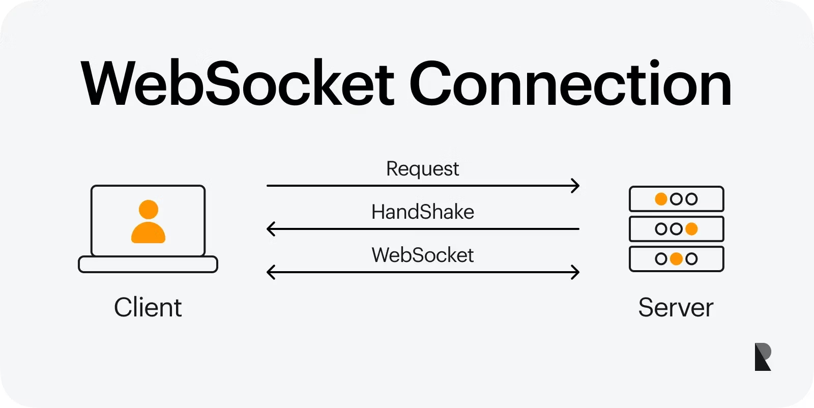

# Overview

The project comes from the following tutorial : https://tutorialedge.net/projects/chat-system-in-go-and-react/.

## Run the project

You need to run both : 
- The front : go to frontend and `run npm start`
- The back : go to backend and run `go run .`
- Access to localhost://3000
You need to have React and Go installed on your machine.

## The WebSocket Protocol

WebSockets basically offer us duplex communication from a non-trusted source to a server that we own across a TCP socket connection. This essentially means that, instead of continually polling our web server for updates and having to perform TCP handshakes every time we poll, we can maintain a single TCP socket connection and then send and listen to messages on that.

This drastically reduces the amount of network overhead that is required for the likes of any real-time application and it allows us to maintain an incredible amount of clients on a single server instance.

### The Cons
WebSockets definitely come with a few cons that are worth considering. As soon as you introduce state, it becomes more complex with regards to scaling up your application across multiple instances.

You have to consider options such as storing your state in message brokers, or in databases/memory caches that can scale in parallel with your application instances.

### The Implementation
When it comes to implementing a WebSocket endpoint, we need to create a new endpoint and then upgrade the connection from a standard HTTP endpoint to a long-lasting WebSocket connection.

Thankfully, the gorilla/websocket package features the functionality we need in order to easily upgrade a HTTP connection to a WebSocket connection with minimal fuss.